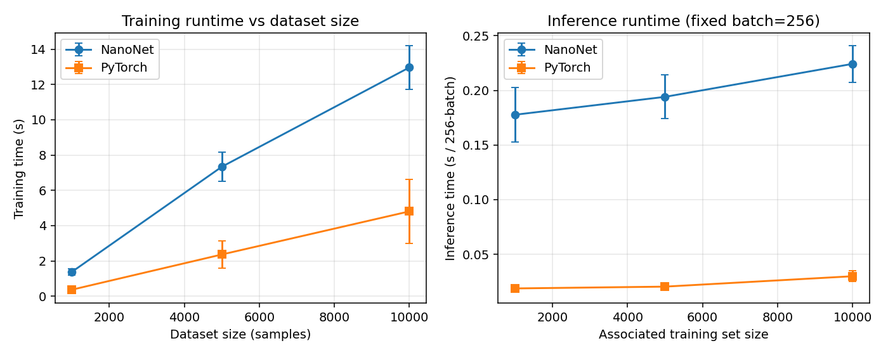

# NanoNet

A neural-network framework built from scratch with Python and NumPy.

NanoNet started as a way for me to understand what frameworks such as PyTorch
are actually doing behind calls like:

```python
loss.backward()
optimizer.step()
```

Instead of wrapping an existing machine-learning library, I implemented the
important pieces directly:

- tensors
- computational graphs
- reverse-mode automatic differentiation
- backpropagation
- trainable parameters
- neural-network layers
- optimizers
- data loading
- training loops
- numerical gradient checking
- model serialization

The goal is not to compete with PyTorch.

The goal is to make the mechanics behind neural-network training small enough
to read and understand.

---

## How It Works

A neural-network training step has two main stages.

### Forward Pass

```text
Input → Dense → ReLU → Dense → Loss
```

NanoNet calculates the output while recording the operations that produced it.

### Backward Pass

```text
Input ← Dense ← ReLU ← Dense ← Loss
```

Calling:

```python
loss.backward()
```

walks the computational graph in reverse and applies the chain rule to
calculate gradients.

Those gradients are then used by an optimizer:

```python
optimizer.step()
```

to update the trainable parameters.

---

## Features

NanoNet currently includes:

### Automatic Differentiation

- reverse-mode automatic differentiation
- computational graph construction
- topological backward traversal
- gradient accumulation
- repeated backward passes
- NumPy-style broadcasting gradients
- numerical gradient checking

### Tensor Operations

- addition
- subtraction
- multiplication
- division
- powers
- negation
- sum
- mean
- reshape
- transpose
- indexing
- exponential
- logarithm
- element-wise maximum
- NumPy-style `matmul`

Matrix multiplication supports:

- vector @ vector
- matrix @ vector
- vector @ matrix
- matrix @ matrix
- batched matrix multiplication
- broadcast batch dimensions

### Neural-Network Components

- `Parameter`
- `Module`
- `Sequential`
- `Dense`
- `ReLU`
- `Sigmoid`
- `Tanh`
- `Softmax`
- `Dropout`
- `Flatten`

### Loss Functions

- Mean Squared Error
- numerically stable Cross Entropy

### Optimizers

- SGD
- momentum
- L2 weight decay
- Adam

NanoNet's Adam weight decay is implemented as **coupled L2
regularization**, not AdamW-style decoupled weight decay.

### Data

- Dataset abstraction
- `TensorDataset`
- mini-batch `DataLoader`
- optional shuffling
- deterministic seeding
- MNIST downloading and caching

### Training

- reusable `Trainer`
- `model.fit(...)`
- `model.evaluate(...)`
- validation metrics
- training history
- plotting support
- `no_grad()` inference

### Model Utilities

- parameter counting
- model summaries
- `state_dict()`
- `.npz` serialization
- JSON parameter metadata

---

## Why I Built NanoNet

Modern machine-learning libraries make it possible to build a neural network
without knowing much about what happens internally.

For example:

```python
loss.backward()
```

looks simple, but underneath it requires:

```text
computational graphs
topological sorting
the chain rule
gradient accumulation
broadcast-gradient reduction
matrix derivatives
```

Similarly:

```python
optimizer.step()
```

requires algorithms such as SGD or Adam to convert those gradients into
parameter updates.

NanoNet was my way of implementing those mechanics myself instead of only
using them through another framework.

---

# Installation

Clone the repository:

```bash
git clone https://github.com/ariv-chaudhry/NanoNet.git
cd NanoNet
```

Create a virtual environment:

```bash
python -m venv .venv
```

Activate it.

### Linux / macOS

```bash
source .venv/bin/activate
```

### Windows PowerShell

```powershell
.\.venv\Scripts\Activate.ps1
```

Install NanoNet and the development dependencies:

```bash
pip install -e ".[dev]"
```

The core library only requires:

```text
NumPy
```

---

# Quick Start

A simple classifier can be created using:

```python
from nanonet import Sequential, manual_seed
from nanonet.layers import Dense, ReLU, Dropout
from nanonet.losses import CrossEntropyLoss
from nanonet.optimizers import Adam

manual_seed(42)

model = Sequential([
    Dense(784, 128),
    ReLU(),
    Dropout(0.2),
    Dense(128, 64),
    ReLU(),
    Dense(64, 10),
])

optimizer = Adam(
    model.parameters(),
    lr=0.001,
)

loss_fn = CrossEntropyLoss()

model.fit(
    X_train,
    y_train,
    loss_fn=loss_fn,
    optimizer=optimizer,
    epochs=10,
    batch_size=64,
)

accuracy = model.evaluate(
    X_test,
    y_test,
)

print(accuracy)
```

The API is intentionally familiar if you've used frameworks such as PyTorch
or Keras, but the underlying implementation is NanoNet's own.

---

# Automatic Differentiation

The core of NanoNet is its automatic-differentiation engine.

Consider:

```python
from nanonet import Tensor

x = Tensor(
    3.0,
    requires_grad=True,
)

y = x**2 + 2*x

y.backward()

print(x.grad)
```

Output:

```text
8.0
```

Mathematically:

```text
y = x² + 2x

dy/dx = 2x + 2
```

At:

```text
x = 3
```

we get:

```text
dy/dx = 8
```

NanoNet creates the computational graph from the operations used to construct
`y`, then traverses that graph backward to calculate the derivative.

---

## Branching Graphs

A Tensor can contribute to the output through multiple paths.

For example:

```python
x = Tensor(
    2.0,
    requires_grad=True,
)

y = x*x + 3*x

y.backward()

print(x.grad)
```

Output:

```text
7.0
```

because:

```text
dy/dx = 2x + 3
```

and:

```text
2(2) + 3 = 7
```

NanoNet automatically combines the gradients from both paths.

---

## Repeated Backward Calls

Gradients accumulate across calls to:

```python
backward()
```

For example:

```python
x = Tensor(
    2.0,
    requires_grad=True,
)

y = x * x

y.backward()

print(x.grad)
```

produces:

```text
4.0
```

Calling:

```python
y.backward()
```

again gives:

```text
8.0
```

Each backward traversal propagates only the gradient generated by that
particular call.

Previously accumulated `.grad` values are stored for the user but are not
incorrectly propagated through the graph again.

---

# Broadcasting

NanoNet supports NumPy-style broadcasting.

For example:

```text
X: (32, 128)
b: (128,)
```

allows:

```python
Y = X + b
```

to produce:

```text
(32, 128)
```

During backward, NanoNet reduces the bias gradient back to:

```text
(128,)
```

rather than incorrectly leaving it as:

```text
(32, 128)
```

This is required for operations such as Dense-layer bias addition.

---

# Matrix Multiplication

NanoNet's `@` operator follows NumPy-style matrix multiplication.

Supported forms include:

```text
vector @ vector
matrix @ vector
vector @ matrix
matrix @ matrix
batched matrix @ matrix
batched matrix @ batched matrix
```

For example:

```python
from nanonet import Tensor

a = Tensor(
    [1.0, 2.0, 3.0],
    requires_grad=True,
)

b = Tensor(
    [4.0, 5.0, 6.0],
    requires_grad=True,
)

y = a @ b

y.backward()
```

Both vectors receive the correct gradients.

The same autograd operation also supports the matrix multiplication required
by Dense layers:

```text
X @ W
```

---

# Neural Networks

Models can be assembled with `Sequential`.

```python
from nanonet import Sequential
from nanonet.layers import Dense, ReLU

model = Sequential([
    Dense(784, 128),
    ReLU(),
    Dense(128, 64),
    ReLU(),
    Dense(64, 10),
])
```

NanoNet automatically tracks Parameters contained within each layer.

You can inspect the model with:

```python
model.summary(
    input_shape=(784,),
)
```

and count trainable parameters with:

```python
print(
    model.num_parameters()
)
```

---

# Training

NanoNet includes a reusable training loop.

```python
from nanonet.training import Trainer

trainer = Trainer(model)

history = trainer.fit(
    X_train,
    y_train,
    loss_fn=loss_fn,
    optimizer=optimizer,
    epochs=10,
    batch_size=64,
    validation_data=(
        X_test,
        y_test,
    ),
)
```

The same functionality is exposed through:

```python
model.fit(...)
```

A training iteration performs:

```text
forward
  ↓
loss
  ↓
clear gradients
  ↓
backward
  ↓
optimizer step
```

---

# Inference and `no_grad()`

Training mode and gradient recording are separate concepts.

To disable layer behavior such as Dropout:

```python
model.eval()
```

To disable autograd graph construction:

```python
from nanonet import no_grad

with no_grad():
    predictions = model(inputs)
```

`model.evaluate(...)` automatically uses both evaluation mode and
`no_grad()`.

This avoids building unnecessary computational graphs during inference.

---

# Cross Entropy

Classification models should pass **raw logits** directly to:

```python
CrossEntropyLoss()
```

For example:

```python
logits = model(inputs)

loss = loss_fn(
    logits,
    targets,
)
```

Do not apply Softmax before Cross Entropy.

NanoNet combines log-softmax and negative log likelihood using a numerically
stable log-sum-exp implementation.

Targets must contain valid integer class labels.

For example:

```text
0
1
2
```

are valid.

A fractional target such as:

```text
1.5
```

raises an error instead of being silently converted to class `1`.

---

# Optimizers

NanoNet includes SGD and Adam implementations written directly with NumPy.

## SGD

Basic SGD performs:

```text
θ ← θ − η∇L
```

Momentum can also be enabled.

## Adam

Adam tracks exponential moving averages of:

```text
gradients
```

and:

```text
squared gradients
```

and uses them to adapt each parameter's update.

NanoNet's Adam `weight_decay` option is **coupled L2 regularization**:

```text
g ← ∇L + λθ
```

The adjusted gradient then enters Adam's moment calculations.

This is different from AdamW, where weight decay is applied separately from
the gradient-based Adam update.

See:

```text
docs/optimizers.md
```

for the full derivation.

---

# Gradient Clearing

Gradients accumulate unless they are cleared.

A typical training step therefore uses:

```python
optimizer.zero_grad()

predictions = model(inputs)
loss = loss_fn(
    predictions,
    targets,
)

loss.backward()

optimizer.step()
```

You can also clear gradients with:

```python
model.zero_grad()
```

NanoNet represents a cleared gradient as:

```python
None
```

rather than allocating an array of zeros.

---

# MNIST

NanoNet includes a fully connected MNIST example.

For a quick smoke test:

```bash
python examples/mnist_mlp.py \
    --epochs 1 \
    --train-limit 5000
```

During development, the model reached:

```text
88.15% test accuracy
```

after one epoch using 5,000 training examples.

For a longer run:

```bash
python examples/mnist_mlp.py \
    --epochs 10 \
    --batch-size 64 \
    --lr 0.001
```

Results vary depending on:

- initialization
- random seed
- training configuration
- number of epochs

The downloaded MNIST files are cached under:

```text
data/mnist/
```

and are not stored in the Git repository.

---

# Nonlinear Regression

NanoNet can also train regression models.

The regression example approximates a nonlinear function using a small
multilayer perceptron.

Run:

```bash
python examples/regression.py
```

---

# Gradient Checking

One of the easiest ways to introduce bugs into an autodiff engine is to write
a backward derivative that looks plausible but is slightly wrong.

NanoNet therefore includes numerical gradient checking.

Example:

```python
from nanonet import Tensor
from nanonet.gradcheck import gradcheck

a = Tensor(
    [1.5, -2.0],
    requires_grad=True,
)

b = Tensor(
    [0.5, 3.0],
    requires_grad=True,
)

result = gradcheck(
    lambda x, y: (x * y).sum(),
    [a, b],
)

print(
    result.passed
)

print(
    result.max_abs_error
)

print(
    result.max_rel_error
)
```

The numerical derivative is calculated using central finite differences and
compared against NanoNet's analytical gradient.

Gradient checks cover operations including:

```text
multiplication
matrix multiplication
vector matrix multiplication
batched matrix multiplication
small neural-network graphs
unused differentiable inputs
```

---

# Model Saving and Loading

Models can be saved using:

```python
model.save(
    "checkpoints/mnist"
)
```

NanoNet automatically normalizes the path and creates:

```text
checkpoints/mnist.npz
checkpoints/mnist.npz.meta.json
```

You can then restore it using:

```python
model.load(
    "checkpoints/mnist"
)
```

Using the suffix explicitly also works:

```python
model.save(
    "checkpoints/mnist.npz"
)
```

NanoNet stores parameters using NumPy `.npz` files and a JSON metadata sidecar.

It does not rely on Python pickle for model parameters.

---

# Model Summary

NanoNet can print layer and parameter information:

```python
model.summary(
    input_shape=(784,),
)
```

Example structure:

```text
Layer                        Output Shape         Parameters
------------------------------------------------------------
Dense(784,128)               ('?', 128)             ...
ReLU                         ('?', 128)               0
Dense(128,64)                ('?', 64)              ...
ReLU                         ('?', 64)                0
Dense(64,10)                 ('?', 10)              ...
------------------------------------------------------------
Total parameters:                                   ...
```

Shape inference is performed without constructing an autograd graph.

---

# Observability

NanoNet makes neural-network internals observable through model inspection,
execution tracing, autograd graph inspection, and evidence-based diagnostics.

| API | Purpose |
| --- | --- |
| `model.inspect()` | Model structure, parameters, shapes, and statistics |
| `model.trace(x)` | Actual module execution order for an input |
| `tensor.graph()` | Autograd operation / dependency graph |
| `model.diagnose(x)` | Numerical and optimization warning checks |

All four APIs share the same conventions:

* print by default; suppress with `verbose=False`
* return a structured report object
* support `print(report)` via `__str__`
* support `report.to_dict()` for JSON-compatible metadata

```python
model.inspect(x)

trace = model.trace(x)

prediction = model(x)
loss = criterion(prediction, target)
loss.graph()

loss.backward()
model.diagnose(x)
```

### Model Inspection

```python
report = model.inspect()
report = model.inspect(x)  # runtime shapes / activations
```

### Execution Tracing

```python
trace = model.trace(x, verbose=False)
for step in trace.steps:
    print(step.module_name, step.outputs[0].shape)
```

Autograd stays enabled so `trace.output` can participate in `backward()`.
Timings include instrumentation overhead (debugging only).

### Computation Graphs

```python
graph = loss.graph(verbose=False)
print(graph.root_id, [op.name for op in graph.operations])
```

Exposes lower-level autograd ops (for example MatMul/Add inside Dense), not
merely module names. Graph IDs are local to each `graph()` call.

### Diagnostics

```python
report = model.diagnose(x, verbose=False)
for finding in report.findings:
    if finding.severity != "info":
        print(finding.code, finding.message)
```

Never calls `backward()`. NaN/Inf checks are definitive; vanishing gradients,
dead ReLU, and saturation are conservative heuristics (`DiagnosticThresholds`).

Detailed notes: [docs/observability.md](docs/observability.md).
Examples: `examples/observability_workflow.py` and the focused scripts under
`examples/`.

---

# Benchmarks

NanoNet is not designed to outperform PyTorch.

PyTorch benefits from:

- optimized C/C++ kernels
- optimized BLAS implementations
- sophisticated memory management
- GPU acceleration
- years of production optimization

NanoNet intentionally prioritizes readability.

The repository includes equivalent synthetic benchmark workloads for NanoNet
and PyTorch.

Run:

```bash
python benchmarks/benchmark_nanonet.py
```

and, if PyTorch is installed:

```bash
python benchmarks/benchmark_pytorch.py
```

Then compare them using multi-trial methodology:

```bash
python benchmarks/compare.py --samples 5000 --runs 5
```

Both frameworks are timed on **CPU** with `float64`. Because synthetic labels
are random, these scripts measure **performance rather than model quality**.

For mathematical validation and MNIST learning comparison, see
[Empirical Evaluation](#empirical-evaluation) below.

---

# Empirical Evaluation

NanoNet has been compared against PyTorch for:

- forward-pass numerical agreement
- loss agreement
- gradient agreement
- SGD update agreement
- multi-trial training/inference runtime
- workload scaling
- matched MNIST learning performance

Full methodology, environment metadata, interpretation, and limitations:
**[docs/evaluation.md](docs/evaluation.md)**.

### Snapshot results (measured, CPU, float64)

| Evaluation | Result |
|---|---:|
| Forward max abs. error | 2.22e-16 |
| Loss abs. error | 2.22e-16 |
| Gradient max abs. error | 1.11e-16 |
| Post-SGD parameter max error | 8.67e-19 |
| NanoNet MNIST accuracy (5k/1k, 1 epoch, SGD) | 66.50% |
| PyTorch MNIST accuracy (matched) | 66.50% |
| Train slowdown @ 5k samples (mean of 5 runs) | ~3.1× |
| Infer slowdown @ 256-batch (mean of 5 runs) | ~9.5× |

Runtime values are machine-dependent (recorded on Windows 11 / Intel CPU;
see JSON under `results/`).



```bash
pip install -e ".[benchmark]"
python benchmarks/numerical_parity.py
python benchmarks/scaling_benchmark.py --sizes 1000 5000 10000 --runs 5
python benchmarks/mnist_comparison.py
python benchmarks/run_evaluation.py --quick   # or --full
```

---

# Testing

Run the complete test suite with:

```bash
pytest -v
```

Run coverage with:

```bash
pytest \
    --cov=nanonet \
    --cov-report=term-missing
```

Run Ruff with:

```bash
ruff check nanonet tests
```

NanoNet's tests cover areas such as:

- Tensor operations
- reverse-mode autodiff
- branching graphs
- repeated backward calls
- broadcasting
- matrix multiplication
- vector MatMul
- batched MatMul
- losses
- class-label validation
- optimizers
- gradient checking
- model serialization
- training
- graph-free evaluation

---

# Examples

Several examples are included.

## Automatic Differentiation

```bash
python examples/autodiff_demo.py
```

## XOR

```bash
python examples/xor.py
```

## Regression

```bash
python examples/regression.py
```

## MNIST

```bash
python examples/mnist_mlp.py
```

## Model Inspection

```bash
python examples/model_inspection.py
```

## Execution Tracing

```bash
python examples/execution_trace.py
```

## Computation Graph Inspection

```bash
python examples/computation_graph.py
```

## Model Diagnostics

```bash
python examples/model_diagnostics.py
```

## Observability Workflow

```bash
python examples/observability_workflow.py
```

---

# Project Structure

```text
NanoNet/
├── nanonet/
│   ├── __init__.py
│   ├── tensor.py
│   ├── autograd.py
│   ├── gradcheck.py
│   ├── serialization.py
│   ├── utils.py
│   │
│   ├── nn/
│   ├── layers/
│   ├── losses/
│   ├── optimizers/
│   ├── data/
│   ├── metrics/
│   ├── training/
│   └── inspection/
│
├── examples/
│   ├── autodiff_demo.py
│   ├── xor.py
│   ├── regression.py
│   ├── mnist_mlp.py
│   ├── model_inspection.py
│   ├── execution_trace.py
│   ├── computation_graph.py
│   ├── model_diagnostics.py
│   └── observability_workflow.py
│
├── benchmarks/
│   ├── benchmark_nanonet.py
│   ├── benchmark_pytorch.py
│   ├── compare.py
│   └── observability_overhead.py
│
├── tests/
├── docs/
├── scripts/
├── README.md
├── LICENSE
├── pyproject.toml
└── .gitignore
```

---

# Architecture

The main relationship between NanoNet's components is:

```text
Tensor
  │
  ▼
Automatic Differentiation
  │
  ▼
Parameter
  │
  ▼
Module / Layer
  │
  ▼
Sequential Model
  │
  ▼
Loss
  │
  ▼
Backward
  │
  ▼
Optimizer
```

Data and training utilities surround this core:

```text
Dataset
   │
   ▼
DataLoader
   │
   ▼
Trainer
   │
   ├──── Model
   ├──── Loss
   └──── Optimizer
```

More detailed explanations are available in:

- [`docs/architecture.md`](docs/architecture.md)
- [`docs/autodiff.md`](docs/autodiff.md)
- [`docs/backpropagation.md`](docs/backpropagation.md)
- [`docs/optimizers.md`](docs/optimizers.md)

---

# Limitations

NanoNet is intentionally small.

Current limitations include:

- CPU / NumPy computation only
- no CUDA backend
- no convolutional layers
- no pooling layers
- no batch normalization
- no multiprocessing DataLoader
- no distributed training
- no mixed-precision training
- no explicit computational-graph freeing API

The project currently focuses on fully connected neural networks and the
mechanics behind their training.

These limitations are deliberate.

Adding fewer features with understandable implementations is more valuable to
the project's goal than attempting to recreate all of PyTorch.

---

# Roadmap

Possible future additions include:

- Conv2D
- MaxPool2D
- BatchNorm
- learning-rate schedulers
- additional datasets
- additional examples
- optional GPU experiments
- mixed-precision experiments

The goal is to add features when they introduce an interesting implementation
or mathematical concept rather than simply increasing the feature count.

---

# License

NanoNet is **source-available, not open source**.

The source code is publicly accessible for viewing, educational reference,
and evaluation purposes. Public availability does not grant permission to
copy, modify, redistribute, republish, sublicense, sell, or incorporate
substantial portions of the project into another project without prior
written permission.

Copyright © 2026 Ariv Chaudhry. All rights reserved.

See [`LICENSE`](LICENSE) for the complete license terms.